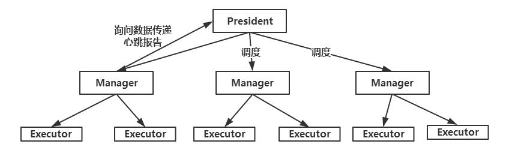
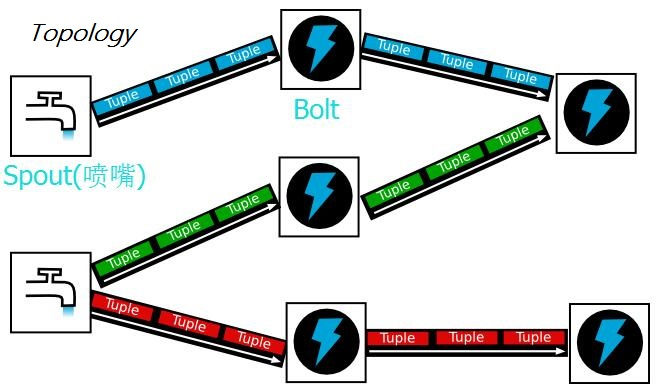

# SandStorm

SandStorm是一个Linux下,简易的分布式实时处理系统。实现思路参考了 **书本《分布式实时处理系统--原理，架构与实现》(作者卢誉声)**。

## 架构介绍

整个分布式系统中，节点分为两种，一种是 **President节点(Master节点)**,一种是**Manager节点(Slave节点)**。Manager节点负责执行 **Executor任务**。如下图所示



Executor又主要分为两种类型：

 - **SpoutExecutor 消息源执行器**
 - **BoltExecutor 消息处理单元执行器**

这个计算模型是参考自Storm分布式处理系统的：



Spout源源不断的产生消息，然后Spout会将数据传输给负责处理数据的BoltExecutor的Manager节点负责处理。

整个系统可以实时不断的运作，有别于MapReduce的批作业处理系统。

## 底层网络封装
SandStorm底层网络是基于Epoll异步事件通知模型实现的，可以应对大量客户端请求并发访问的情况。

## 系统使用

### 编译
程序使用CMake(version >=3.9)进行构建，所以只需进入项目目录，执行

```
cmake
```

执行cmake命令就可以编译出makefile文件，然后执行

```
make
```

用make命令进行编译。

### 用户任务编写

系统通过加载用户编写的任务程序来进行任务处理。

用户编写的整个任务模型称为**Topology**，一个用户编写的Topology中，需要实现Bolt和Spout两种组件。

以下以wordcount程序为例，看系统的简单使用。

### 编写Spout

编写HelloWorldSpout.cpp用以产生数据源，源源不断产生数据。

``` c++
void HelloWorldSpout::Prepare(std::shared_ptr<sandstorm::collector::OutputCollector> outputCollector) {
    _outputCollector = outputCollector;
    _words = SplitString("Hello world there are some words we generate new sentence randomly", ' ');
}

void HelloWorldSpout::Cleanup() {
}

std::vector<std::string> HelloWorldSpout::DeclareFields() {
    return {"sentence"};
}


void HelloWorldSpout::NextTuple() {
    static int32_t id = 0;

    int64_t currentMicroseconds = 0;

    ++id;

    std::vector<std::string> words(5);
    for (int32_t i = 0; i < 5; i++) {
        words[i] = _words[rand() % _words.size()];
    }

    std::string sentence = JoinString(words);
    _outputCollector->Emit({
                                   sentence, currentMicroseconds, id
                           });

}
```

### 编写Bolt

编写SplitSentenceBolt消息处理器，用来分解句子成单词。

``` c++
void SplitSentenceBolt::Prepare(std::shared_ptr<sandstorm::collector::OutputCollector> outputCollector) {
    _outputCollector = outputCollector;
}

void SplitSentenceBolt::Cleanup() {
}

std::vector<std::string> SplitSentenceBolt::DeclareFields() {
    return {"word"};
}

void SplitSentenceBolt::Execute(const sandstorm::base::Tuple &tuple) {
    std::string sentence = tuple[0].GetStringValue();
    int64_t sourceMicroseconds = tuple[1].GetInt64Value();
    int32_t id = tuple[2].GetInt32Value();

    std::vector<std::string> words = SplitString(sentence, ' ');

    for (const std::string &word : words) {
        _outputCollector->Emit({word, sourceMicroseconds, id});
    }
}
```


编写WorldCountBolt消息处理器，用来统计单词。

``` c++
void WordCountBolt::Prepare(std::shared_ptr<sandstorm::collector::OutputCollector> outputCollector) {
    _outputCollector = outputCollector;
}

void WordCountBolt::Cleanup() {
}

std::vector<std::string> WordCountBolt::DeclareFields() {
    return {"word", "count"};
}

void WordCountBolt::Execute(const sandstorm::base::Tuple &tuple) {
    std::string word = tuple[0].GetStringValue();
    int64_t sourceMicroseconds = tuple[1].GetInt64Value();
    int32_t id = tuple[2].GetInt32Value();

    auto wordCountIterator = _wordCounts.find(word);
    if (wordCountIterator == _wordCounts.end()) {
        _wordCounts.insert({word, 0});
        wordCountIterator = _wordCounts.find(word);
    }

    wordCountIterator->second++;

    std::cout << word << ' ' << wordCountIterator->second << std::endl;
    _outputCollector->Emit({word, wordCountIterator->second});

    int64_t currentMicroseconds = 0;

}
```

### 编写Topology
最后我们要编写出Topology来封装整个任务模型

WorldCountTopology.cpp

``` c++
sandstorm::topology::Topology *GetTopology() {
    sandstorm::topology::Topology *topology = new sandstorm::topology::Topology("word-count-topology");

    topology->SetSpout("hello-world-spout", new HelloWorldSpout)
            .ParallismHint(1);

    topology->SetBolt("split-sentence-bolt", new SplitSentenceBolt)
            .Random("hello-world-spout")
            .ParallismHint(3);

    topology->SetBolt("word-count-bolt", new WordCountBolt)
            .Random("split-sentence-bolt")
            .ParallismHint(2);

    return topology;
}
```

以上代码都在代码的Sample目录下，可以进行查看。
